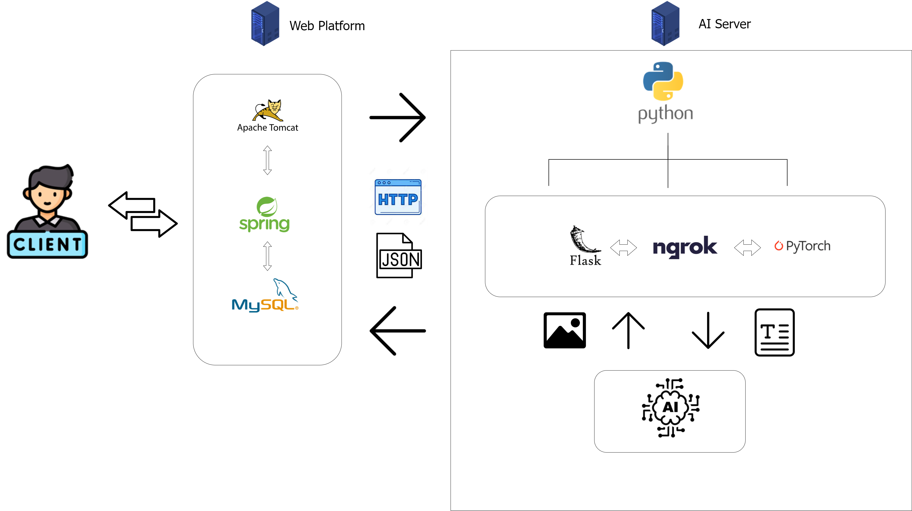

# capston_design
for illustration in web novel

:smile:   
- [X] add report 
- [X] add model description   

## Goal
본 프로젝트를 통해, 작가가 삽화가에게 삽화 외주를 맡기는 과정에서 발생하는 문제를 해결하고자 한다.      
웹 소설 플랫폼에 자체적인 AI model을 구축함으로써, 안정적인 system을 유지한다.    

---   
**발생하는 효과들**   
*시간적, 금전적 문제 해결*   
*작가가 원하는 등장인물 생성*   
*Tag를 통한 간단하고 편리한 생성*   
*작가의 의견 즉각 반영*   
*30초 정도의 짧은 시간으로 이미지 생성*   
*독자의 흥미도 증가*   
*일관성있는 등장인물 제공*   

---
## code description

**flask_web.py**

1. web server 구동   
2. multithreading 기능 (다수의 user 고려)   
3. 경로에 따른 기능 제공     
  - using diffusers   
    - /txt2img   
      - 등장인물 sample 생성.   
      - 4개의 ai model을 불러와서 각각 한 장씩 이미지를 생성한다.   
      - 총 4장의 이미지를 생성한 뒤, JSON format으로 response한다.    
    - /copy_image   
      - 작가가 원하는 등장인물을 학습하는 기능.   
      - 작가가 선택한 등장인물 사진 한 장으로는 학습을 진행하기에는 어려움이 존재하기에, 먼저 다양한 배경, 표정, 각도에 대해서 이미지를 20장 생성해준다.   
      - 20장의 이미지로 늘릴 때, 사용되는 prompt는 copy_prompt.txt에 존재. (동일한 model, seed, prompt를 활용한다)     
      - 20장의 이미지를 만들었으면, dreambooth를 이용하여 학습을 진행한다. (학습 시간이 대략 30분 정도이니, multi thread를 활용하여 학습을 진행한다는 response를 보냄)   
      - 학습을 완료했으면, 완료 flag를 web platform에 response해준다.   
    
    - /inference
      - 작가가 등장인물 삽화를 생성할 때 사용하는 기능.   
      - 학습이 완료된 ai model에게 instance prompt & Tag 를 전달하여 4장의 이미지를 생성. JSON format으로 response.    
    - /img2img
      - image to image 기능.   
    
  - using invoke AI generation toolkit (application)
    - /16_9   
      - 이미지의 종횡비를 16:9로 생성.   
    - /up   
      - 이미지를 받으면 X2로 scaling.   
    - /user   
      - invoke ai로 image를 생성.   
  
---
## model description

우리가 사용한 ai model은 총 4개로, 각각 mid-journey style, anime style 2개씩이다. (CivitAi site에서 제공하는 model을 ckpt -> diffusers format으로 바꿔서 사용)   
mid-journey : *RevAnimate*, *dreamshaper*      
anime : *Pastelboys*, *Counterfiet*      

---
## 기타

- yolov5
  - 해당 기능은 auto-inpainting을 위하여 특정 부분(ex. 얼굴)을 detection하는 기능을 제공.   
- auto-inpainting
  - 해당 기능은 object의 얼굴, 손 등의 뭉개짐 현상을 완화시키기 위해서 제공을 했지만, 얼굴이 일부 바뀌는 문제가 존재.   
  등장인물의 일관성이 중요한 웹 소설에선 사용이 불가능하다고 판단하여 제거.   
> model의 경우 .ckpt file -> diffusers format으로 바꿔줘야 diffusers library로 불러올 수 있다. 관련 내용은 requirements.txt에도 들어가있음   

---
## result   

      

